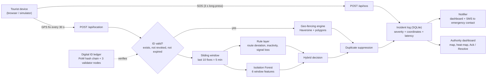
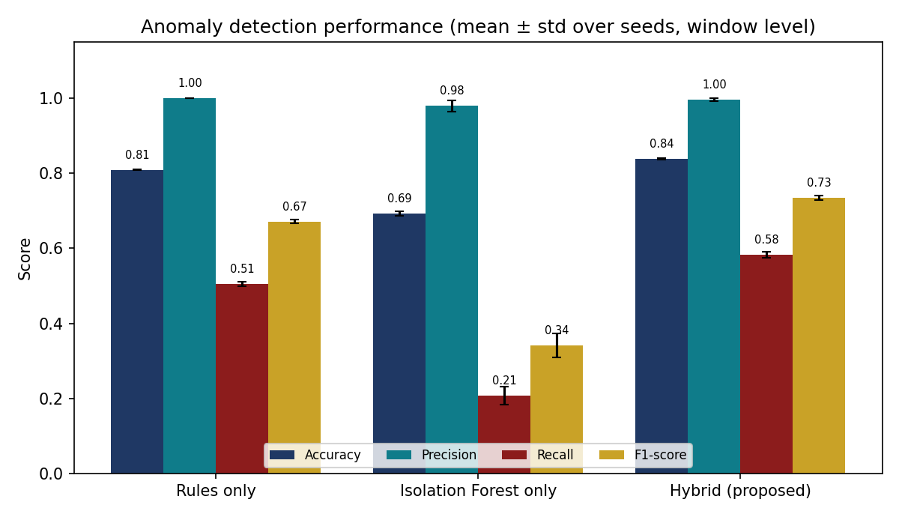
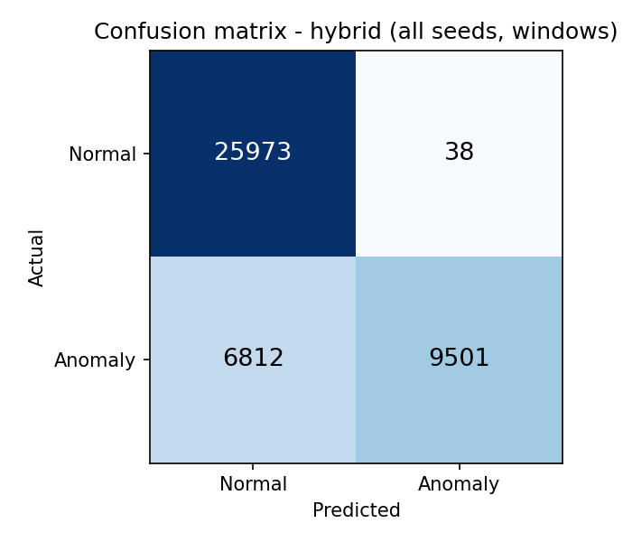
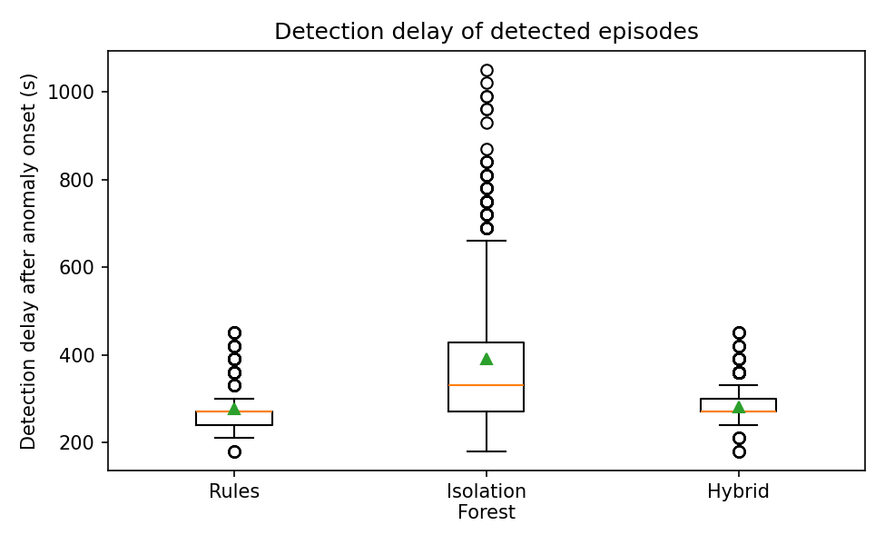
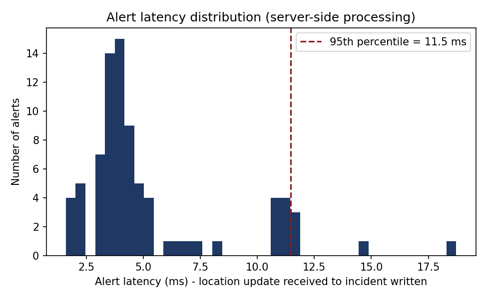
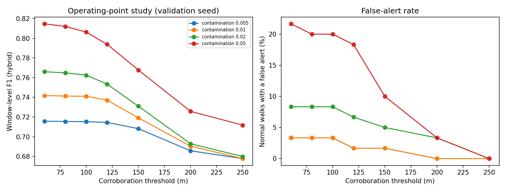
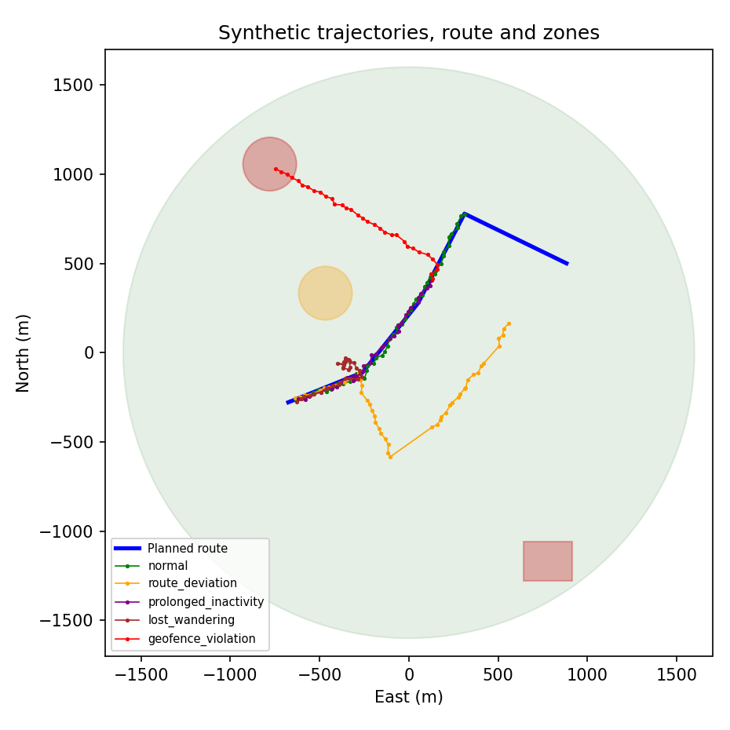

<div align="center">

# 🛡️ Tourist Safety Monitoring & Incident Response System
### AI Anomaly Detection · Geo-Fencing · Blockchain-based Digital Tourist ID

*A Smart India Hackathon (SIH) problem statement, prototyped end to end in Python.*


**Programming with Python (PWP) · B.Tech ICT · Marwadi University, Rajkot**

</div>

---

## 📌 Table of contents
1. [What this project is](#-what-this-project-is)
2. [Key features](#-key-features)
3. [Architecture](#-architecture)
4. [Quick start](#-quick-start)
5. [Demo guide](#-demo-guide)
6. [How each module works](#-how-each-module-works)
7. [Evaluation and results](#-evaluation-and-results)
8. [API reference](#-api-reference)
9. [Configuration](#-configuration)
10. [Project structure](#-project-structure)
11. [Tests](#-tests)
12. [Security and privacy notes](#-security-and-privacy-notes)
13. [Limitations (please read)](#-limitations-please-read)
14. [Roadmap: Phase 2](#-roadmap-phase-2)
15. [Research context](#-research-context)
16. [References](#-references)
17. [Academic details](#-academic-details)
18. [Author, contribution and tools](#-author-contribution-and-tools)

---

## 🎯 What this project is

Tourists in unfamiliar, crowded or remote places face accidents, theft, harassment, medical emergencies and the risk of straying into unsafe zones. Today, help depends mostly on the tourist **manually** calling or pressing a panic button, so authorities learn about problems late, the exact location is unclear, and nobody can quickly verify who the tourist is.

This project is a working Python prototype of **one integrated system** that:

1. **Continuously monitors** a tourist's location against safe, caution and restricted zones (geo-fencing).
2. **Detects distress early with AI**: route deviation, prolonged inactivity, signal loss and unusual wandering, **without any action from the tourist**.
3. Issues a **tamper-evident Digital Tourist ID** (salted-hash identity, proof-of-work hash chain, HMAC-signed QR, simulated validator network).
4. **Responds automatically**: every alert becomes a severity-graded incident with coordinates and a **measured latency**, and notifications go to the authority dashboard and the emergency contact.
5. Gives authorities a **live dashboard**: map, tracks, zones, heat-map, risk score, incident lifecycle and ledger status.

> **Everything reported below is measured by running the code in this repository** (`python evaluate.py`). Nothing is hard-coded. Where something is simulated or limited, this README says so.

---

## ✨ Key features

| Area | What is implemented |
|---|---|
| **Digital Tourist ID** | Per-record random salt + server pepper → SHA-256 passport hash (raw passport is never stored); canonical-JSON payload hash; **proof-of-work** hash-chained blocks; **3-node permissioned validator network with majority consensus**; **HMAC-signed QR**; 7-check verification; revocation; full ledger audit; tamper / heal demo |
| **Geo-fencing** | Safe, caution and restricted zones; **circles (Haversine) and polygons**; edge-triggered events with **hysteresis** (no flapping from GPS noise); **proactive "approaching restricted zone" warning**; entry and exit events |
| **AI anomaly detection** | Interpretable rules (route deviation, inactivity with rest-point exemption, signal loss) + **Isolation Forest** trained only on normal movement + spatial corroboration (**hybrid**) |
| **Incident response** | One pipeline: fix → ID check → geo-fence → anomaly → duplicate suppression → incident (latency measured) → notifications; manual **SOS**; **watchdog** for silent devices; incident **Acknowledge / Resolve** |
| **Authority dashboard** | Offline-safe live SVG map, tracks, zones, planned route, rest points, **risk heat-map**, per-tourist **risk score**, incident log, notification log, ledger network panel, scenario player, one-click **captioned Auto demo**; optional folium street map |
| **Tourist phone view** | **3-second long-press SOS** (avoids accidental alerts), live browser GPS, **offline queue** for fixes and SOS with automatic retry, idempotent SOS (no duplicates), **English / हिन्दी / ગુજરાતી** |
| **Simulation** | Ground-truth-labelled synthetic GPS trajectories: normal (pauses, rest stops, harmless side-trips), route deviation, prolonged inactivity, lost/wandering, geo-fence violation, signal loss |
| **Evaluation** | 5-seed ablation (rules vs Isolation Forest vs hybrid), per-anomaly-type results, operating-point sweep on a separate validation seed, geo-fence / ID / tamper / end-to-end tests through the real Flask app, charts and an auto-generated report |
| **Quality** | 28 automated tests including regression tests for earlier bugs |

---

## 🏗️ Architecture



**Five layers:** Registration → Tracking → Analysis → Response → Presentation.

---

## 🚀 Quick start

**Requirements:** Python (developed and tested on **Python 3.12**; other recent 3.x versions are expected to work), `pip`, and a modern browser.

```bash
# 1. Get the code
git clone https://github.com/HarshParmar029/Phase-1-PWP_Project-Deliverables.git
cd Phase-1-PWP_Project-Deliverables

# 2. (Recommended) virtual environment
python -m venv .venv
.venv\Scripts\activate          # Windows PowerShell
# source .venv/bin/activate     # macOS / Linux

# 3. Install dependencies
pip install -r requirements.txt

# 4. Run the web app
python app.py
```

Open **http://127.0.0.1:5000**. On first use the Isolation Forest is trained automatically on simulated normal trajectories (a short one-time step).

> If the repository root contains a single project folder (for example `tourist_safety_prototype/`), `cd` into the folder that contains `app.py` before step 3.

### Other commands

```bash
python evaluate.py                           # reproduce every number in this README (takes a few minutes) -> results/
python evaluate.py --quick                   # small smoke run
python train_model.py                        # (re)train the Isolation Forest
python -m unittest discover -s tests -v      # 28 automated tests
```

`evaluate.py` uses a **temporary database**, so it never touches your demo data. To reset demo data: stop the server and delete `data/safety.db*`.

---

## 🎬 Demo guide

| Page | URL | Purpose |
|---|---|---|
| Title card | `/intro` | Animated project title (used at the start of the demo video) |
| Register | `/register` | Create a Digital Tourist ID with QR |
| Verify | `/verify/<tourist_id>` | 7-check verification of an ID |
| Verify by QR | `/scan` | Authority pastes the scanned QR text |
| Tourist phone view | `/tourist/<tourist_id>` | SOS, live GPS, offline queue, 3 languages |
| Authority dashboard | `/dashboard` | Live map, incidents, notifications, ledger network |
| Automatic demo | `/dashboard?autodemo=1` | Runs the whole captioned demo by itself (a few minutes) |
| Street map (optional) | `/map` | folium / OpenStreetMap view (needs internet) |

**Manual walkthrough**
1. Register a tourist → see the QR, payload hash, block hash and validator votes → press **Verify ID**.
2. Open the **Dashboard**, pick the tourist and press a scenario: *Geo-fence violation*, *Route deviation*, *Prolonged inactivity*, *Lost / wandering*, *Signal loss*, **SOS**. The marker walks and incidents appear live.
3. **Acknowledge / Resolve** incidents; toggle the heat-map layer.
4. In **Ledger network** press *Tamper Node-2* → the node turns `TAMPERED` while consensus stays OK → *Run audit* → *Heal from majority*. Tamper two nodes and consensus is correctly lost.
5. Press **▶ Auto demo** to watch all of the above with on-screen captions.

> ⚠️ **Do not use "Start live GPS" during a demo** unless you are near Somnath. The zones are defined around Somnath, Gujarat, so a real GPS fix elsewhere correctly raises "left safe zone" and, later, route-deviation and inactivity alerts.

---

## 🔬 How each module works

### 1. Digital Tourist ID (`digital_id.py`, `ledger_network.py`)

- **Passport privacy:** `passport_hash = SHA-256(pepper + random_salt + passport)`. Only the hash and salt are stored. An authority can later check a physical passport with `verify_passport()`.
- **Payload:** tourist ID, name, nationality, passport hash, emergency contact, validity period → canonical JSON → SHA-256.
- **Block:** `block_hash = SHA-256(index | payload_hash | previous_block_hash | timestamp | nonce)` with **proof-of-work** (hash must start with `POW_DIFFICULTY = 3` hex zeros).
- **Validator network:** 3 simulated nodes each hold a copy of the chain. A new block is committed only if a **majority (2 of 3)** validates it. A tampered node is flagged `TAMPERED`; the majority still decides; `heal` re-syncs it.
- **QR code:** `TID:… | HASH:<16-char prefix> | SIG:<HMAC-SHA256> | VERIFY:/verify/<id>`. A forged or edited QR fails the HMAC check.
- **Seven verification checks:** record exists · ledger entry exists · payload hash matches ledger · whole hash chain intact · validator-network consensus · not expired (default validity 7 days) · not revoked.

### 2. Geo-fencing (`geofence.py`)

- Distance: Haversine, `a = sin²(Δφ/2) + cos φ₁ cos φ₂ sin²(Δλ/2)`, `d = 2R·arcsin(√a)`, `R = 6,371,008.8 m`. Polygons use ray-casting with metric distance to the boundary.
- A fix is inside a zone when its signed boundary distance ≤ 0. Leaving requires being more than `GEOFENCE_HYSTERESIS_M = 15 m` outside, which stops GPS noise at a boundary from flooding the log.

| Event | Severity | Trigger |
|---|---|---|
| `GEOFENCE_VIOLATION` | HIGH | entered a restricted zone |
| `RESTRICTED_ZONE_APPROACH` | LOW | within 100 m of a restricted zone (proactive warning) |
| `CAUTION_ZONE_ENTRY` | LOW | entered a caution zone |
| `LEFT_RESTRICTED_ZONE` | LOW | left a restricted zone |
| `LEFT_SAFE_ZONE` | LOW | left the safe zone |

**Zones (simulation only, around Somnath, Gujarat):** one safe zone (1,600 m radius), one caution zone (*Crowded Market Lane*), two restricted zones (*Restricted Coastal Cliff Area*, a circle, and *Restricted Construction Site*, a polygon), a five-waypoint planned route and two rest points. All are in `config.py`.

### 3. AI anomaly detection (`anomaly.py`, `train_model.py`)

A sliding window of the **last 10 fixes (5 minutes)** is turned into six features: mean and maximum distance from the planned route (point-to-polyline), mean speed, net displacement, path length and circular heading variance.

| Layer | Rule | Alert |
|---|---|---|
| Rules | last **3** fixes all farther than **250 m** from the planned route | `ROUTE_DEVIATION` (MEDIUM) |
| Rules | net displacement over a full window below **20 m** and **not** near a designated rest point | `PROLONGED_INACTIVITY` (HIGH) |
| Rules | gap between fixes above **120 s** (or no fix at all, found by the watchdog) | `SIGNAL_LOSS` (MEDIUM on resume, HIGH from the watchdog) |
| Machine learning | **Isolation Forest** (scikit-learn, 100 trees, contamination 0.01) trained **only on normal trajectories** (150 trajectories = 5,850 windows) | outlier flag |
| **Hybrid** | rule fires **or** (Isolation Forest outlier **and** max route deviation in the window > **120 m**) | `BEHAVIOR_OUTLIER` (MEDIUM) |

Why hybrid: rules are precise and explainable but cannot describe behaviour nobody wrote a rule for; the Isolation Forest needs no labelled anomalies but, on its own, raises false alarms when tourists pause normally. The spatial corroboration check keeps the forest's alerts meaningful.

### 4. Incident response (`engine.py`, `notifier.py`)

- Every location update flows through `SafetyEngine.process_fix()`; the **alert latency** is measured from "update received" to "incident written" and stored with the incident.
- Duplicate suppression: the same anomaly type is not re-raised while it stays active.
- **SOS:** location priority is coordinates sent with the SOS → last fix in memory → last fix stored in the database → none. **SOS never fails for lack of GPS.** A client `request_id` makes retries idempotent.
- **Watchdog:** `check_stale()` raises `SIGNAL_LOSS` when a device goes silent for more than 120 s.
- **Notifications:** every incident writes a `DASHBOARD` notification; incidents of severity **HIGH or CRITICAL** also create an **SMS to the emergency contact** with coordinates and a map link. The SMS channel is **simulated** (delay drawn from a log-normal model) unless `TWILIO_SID`, `TWILIO_TOKEN` and `TWILIO_FROM` are set and the `twilio` package is installed.
- **Risk score** per tourist = sum of open incident weights (LOW 1, MEDIUM 3, HIGH 6, CRITICAL 10), capped at 100.

### 5. Simulator (`simulator.py`)

Tourists walk the route at about **1.2 m/s** (individual pace varies), one fix per **30 s**, Gaussian GPS noise **σ = 6 m**, with natural lateral wander, random short photo pauses, optional legitimate stops at rest points and harmless side-trips. Six labelled scenarios: `normal`, `route_deviation` (about 500 m perpendicular drift), `prolonged_inactivity` (about 7 min), `lost_wandering`, `geofence_violation`, `signal_loss`.

---

## 📊 Evaluation and results

Run `python evaluate.py` to regenerate everything in [`results/`](results/): `REPORT.md`, `metrics.json`, `anomaly_table.csv`, `sweep.csv` and six figures. Setup: **5 seeds**, 150 training trajectories per seed, 60 test trajectories per scenario, 8,481 test windows per seed. A window is labelled anomalous when at least half of its fixes belong to the injected anomaly.

### Anomaly detection (mean ± std over 5 seeds)

| Detector | Accuracy | Precision | Recall | F1 | Episode detection | Mean delay | Normal walks with a false alert |
|---|---|---|---|---|---|---|---|
| Rules only | 0.81 ± 0.00 | 1.00 ± 0.00 | 0.51 ± 0.01 | 0.67 ± 0.00 | 76.2 % | 276 s | 0.3 % |
| Isolation Forest only | 0.69 ± 0.01 | 0.98 ± 0.02 | 0.21 ± 0.02 | 0.34 ± 0.03 | 78.7 % | 389 s | 8.3 % |
| **Hybrid (proposed)** | **0.84 ± 0.00** | **1.00 ± 0.00** | **0.58 ± 0.01** | **0.73 ± 0.01** | **97.9 %** | 281 s | 3.7 % |

**Episode detection and delay by anomaly type**

| Anomaly | Rules | Isolation Forest | Hybrid |
|---|---|---|---|
| Route deviation | 100 % / 254 s | 60 % / 651 s | 100 % / 254 s |
| Prolonged inactivity | 100 % / 268 s | 79 % / 276 s | 100 % / 268 s |
| Lost / wandering | 29 % / 382 s | 96 % / 322 s | 94 % / 325 s |

**How to read this honestly**
- The hybrid's benefit is **coverage**: episode detection rises from 76.2 % (rules) to 97.9 %, mainly because it catches *lost / wandering* behaviour that no rule describes (29 % → 94 %). It also cuts the Isolation Forest's false-alert walks from 8.3 % to 3.7 %.
- The hybrid is **not faster than the rules** on average (281 s vs 276 s) and is not faster on route deviation or inactivity.
- **Window-level recall is 0.58, below the 0.90 target.** The first windows of an anomaly are not yet distinguishable from normal movement. The O2 target is met at **episode level** (97.9 % ≥ 90 %, false alerts 3.7 % ≤ 10 %).

### Geo-fencing, Digital ID and end-to-end

| Component | Result |
|---|---|
| Geo-fencing, 240 trajectories | accuracy / precision / recall **100 %** (TP 120, FP 0, FN 0, TN 120); violation raised at the exact first inside fix in 100 % of cases; early approach warning first in 100 % (mean lead 91 s) |
| Geo-fencing, random points | 15,979 random points near zone boundaries, **0** disagreements with an independent planar reference |
| Digital ID verification, 200 IDs | 100 % valid IDs accepted; verification mean **3.31 ms**, p95 **5.08 ms**; registration mean 15.1 ms (including proof-of-work) |
| Tamper detection | **50 / 50** detected across 8 kinds (name, nationality, contact, validity, payload hash, block hash, previous hash, deleted block); restored records verify again; forged QR rejected 100 %; expired ID rejected |
| Validator network | 1 of 3 nodes tampered → node flagged, consensus holds, ID still valid; 2 of 3 tampered → consensus lost, ID rejected (a compromised majority is correctly not trusted) |
| End-to-end through the Flask API | **60 / 60** runs succeeded (register → verify → track → alert → log → notify); 10 / 10 in each of 6 scenarios |
| Alert latency (server-side), 81 incidents | mean **5.2 ms**, p50 4.1 ms, p95 **11.5 ms**, p99 15.3 ms, max 18.7 ms |
| SMS (simulated delivery), 33 messages | p95 including the simulated delay: 3.57 s |

### Objectives

| ID | Objective | Result |
|---|---|---|
| O1 | Geo-fencing: entry/exit, zone types | **Met.** 100 % correct; processing p95 11.5 ms (< 5 s) |
| O2 | Anomaly detection ≥ 90 % detection, ≤ 10 % false alerts | **Met at episode level** (97.9 %, 3.7 %); window-level recall 0.58 is below 0.90 |
| O3 | Tamper-evident ID: 100 % tamper detection, < 3 s | **Met.** 50 / 50; verification p95 5.08 ms |
| O4 | Automated alert with coordinates in ≤ 10 s | **Met for server-side processing** (p95 11.5 ms; p95 incl. *simulated* SMS delay 3.57 s). Real SMS delay is not measured |
| O5 | Integrated system, end-to-end evaluation | **Met.** 60 / 60 runs |

### Figures

| | |
|---|---|
|  |  |
|  |  |
|  |  |

<!--
UI screenshots: create docs/screenshots/ and add your own captures, for example:


-->

### Reproducibility
Seeds are fixed in `evaluate.py` (training seeds 0-4, separate seed ranges for test sets, a separate validation seed for the operating-point sweep). The committed `results/` were produced in an environment where `geopy` was not installed, so the Haversine-vs-geopy cross-check line reads "skipped"; with `pip install -r requirements.txt` it runs and is included when you re-run `python evaluate.py`.

---

## 🔌 API reference

<details>
<summary><b>Click to expand all endpoints</b></summary>

| Method | Path | Purpose |
|---|---|---|
| GET | `/` , `/intro` , `/register` , `/scan` , `/dashboard` | Pages |
| POST | `/register` | Create a Digital Tourist ID (form: `name`, `nationality`, `passport`, `emergency_contact`) |
| GET | `/verify/<tourist_id>` | 7-check verification page |
| GET | `/tourist/<tourist_id>` | Tourist phone view |
| POST | `/api/location` | `{tourist_id, lat, lon, timestamp?}` → events raised for this fix and processing latency |
| POST | `/api/sos` | `{tourist_id, lat?, lon?, note?, request_id?}` → CRITICAL incident (works without GPS) |
| POST | `/api/reset/<tourist_id>` | Start a new monitoring run (clears windows and geo-fence state) |
| GET | `/api/demo/<scenario>` | Generate a simulated trajectory (`normal`, `route_deviation`, `prolonged_inactivity`, `lost_wandering`, `geofence_violation`, `signal_loss`) |
| POST | `/api/demo_tourist` | Create a demo tourist (used by the Auto demo) |
| POST | `/api/verify_qr` | `{qr}` → verification of a scanned QR string |
| POST | `/api/incident/<id>/ack` , `/resolve` | Incident lifecycle |
| POST | `/api/network/tamper` , `/audit` , `/heal` | Ledger-network demo actions |
| GET | `/api/state` | Everything the dashboard shows (stats, tourists, incidents, notifications, zones, route, heat, network) |
| GET | `/map` | folium street-map view (requires `folium` and internet for map tiles) |

Errors on `/api/*` always return JSON (never an HTML error page).

</details>

---

## ⚙️ Configuration

All thresholds live in [`config.py`](config.py) so the app and the evaluation always use identical settings.

<details>
<summary><b>Key parameters</b></summary>

| Parameter | Value | Meaning |
|---|---|---|
| `WINDOW_SIZE` / `FIX_INTERVAL_S` | 10 / 30 s | sliding window = 5 minutes |
| `ROUTE_DEV_M` / `ROUTE_DEV_CONSEC` | 250 m / 3 fixes | route-deviation rule |
| `INACTIVITY_NET_M` | 20 m | inactivity rule |
| `GAP_LOSS_S` | 120 s | signal-loss threshold |
| `IF_TREES` / `IF_CONTAMINATION` | 100 / 0.01 | Isolation Forest |
| `HYBRID_DEV_M` | 120 m | corroboration threshold |
| `GEOFENCE_HYSTERESIS_M` / `APPROACH_WARN_M` | 15 m / 100 m | boundary hysteresis / early warning |
| `POW_DIFFICULTY` / `NUM_LEDGER_NODES` | 3 / 3 | proof-of-work zeros / validator nodes |
| `ID_VALIDITY_DAYS` | 7 | Digital ID validity |
| `NOTIFY_MIN_SEVERITY` | HIGH | SMS to the emergency contact from this severity upward |
| `GPS_NOISE_SIGMA_M` / `WALK_SPEED_MS` | 6 m / 1.2 m/s | simulator |

**Environment variables:** `TSAFETY_SECRET`, `TSAFETY_PEPPER` (change both for any real use), `TSAFETY_DB`, `TSAFETY_MODEL`, and optionally `TWILIO_SID`, `TWILIO_TOKEN`, `TWILIO_FROM`.

</details>

---

## 🗂️ Project structure

```
.
├── app.py               Flask app: pages + JSON API + dashboard state
├── engine.py            Pipeline: fix → ID check → geo-fence → anomaly → incident → notify; SOS; watchdog
├── digital_id.py        Salted passport hash, payload hash, PoW blocks, HMAC QR, 7-check verification, audit
├── ledger_network.py    Simulated permissioned network: majority validation, tamper, heal
├── geofence.py          Haversine circles + polygons, hysteresis, edge-triggered events
├── anomaly.py           Features, rule layer, Isolation Forest, hybrid decision
├── simulator.py         Ground-truth-labelled synthetic GPS trajectories (6 scenarios)
├── train_model.py       Trains the Isolation Forest on normal trajectories
├── notifier.py          Dashboard + SMS notifications (SMS simulated unless Twilio configured)
├── database.py          SQLite schema and helpers (WAL mode)
├── evaluate.py          Reproducible evaluation → results/
├── config.py            Zones, route, thresholds, secrets (env-overridable)
├── utils.py             Time helpers and local metric projection
├── templates/           base, intro, index, register, digital_id, verify, scan, tourist, dashboard
├── static/              dashboard.js (SVG map, auto demo), tourist.js (SOS, GPS, offline queue)
├── tests/test_system.py 28 automated tests
├── results/             Generated report, metrics, CSVs and figures
├── data/  models/       Created at run time (git-ignored)
└── requirements.txt
```

Roughly 2,900 lines of Python, JavaScript and HTML including tests.

---

## 🧪 Tests

```bash
python -m unittest discover -s tests -v
```

28 tests cover: Haversine against known values (and against `geopy` when installed); circle and polygon geometry against an independent reference; edge-triggered events, hysteresis and exit events; Digital ID registration, passport privacy, record tampering, expiry, revocation, forged QR, validator consensus and healing; route-deviation, inactivity (including the rest-point exemption) and signal-loss rules; end-to-end API flows; SOS without any GPS fix, SOS from the last stored location and SOS idempotence; the QR scan page; and the watchdog. One test (the `geopy` cross-check) is skipped automatically when `geopy` is not installed.

---

## 🔐 Security and privacy notes

- The raw passport number is **never stored**: per-record random salt + server pepper + SHA-256.
- QR codes are **HMAC-signed**; any edit is rejected.
- Dashboard and API have **no authentication** in this prototype (see limitations).
- The default `SECRET_KEY` and pepper in `config.py` are **development values**. Set `TSAFETY_SECRET` and `TSAFETY_PEPPER` for any real use. Flask's development server is used; it is not a production server.
- Coordinates in this repository are approximate and for simulation only.

---

## ⚠️ Limitations (please read)

- **All accuracy results are on synthetic data** with simulated GPS noise. Real-world performance may differ; validation on real trajectory datasets is future work.
- **Window-level recall of the hybrid (0.58) is below the 0.90 target.** The target is met at episode level. The hybrid is not faster than the rules on average; its advantage is coverage.
- **Alert latency measures server-side processing only.** The SMS channel is **simulated** unless Twilio credentials are configured; real delivery time is not measured. RQ4's comparison with manual reporting is **not** quantified (it would need a user study).
- **The "blockchain" is a single-process simulation** of a permissioned network (majority validation plus proof-of-work). It is not a public blockchain and has no Byzantine-fault-tolerant protocol. Validator nodes are seeded from the persisted ledger at start-up.
- Per location update the engine checks that the ID exists, is not revoked and not expired; the **full chain verification** runs on `/verify`, `/scan` and the dashboard audit.
- **No authentication** on the dashboard or API; engine state (sliding windows) is in memory and resets on restart (the database persists).
- Live GPS uses the **browser** Geolocation API (needs HTTPS or localhost). There is no native mobile app.
- Zones, route and rest points are fixed in `config.py` around Somnath.

---

## 🗺️ Roadmap: Phase 2

- [ ] Validation on real trajectory datasets
- [ ] Measure real SMS / push delivery (e.g. Twilio) and a manual-reporting baseline
- [ ] Native mobile app (background GPS, battery-aware sampling)
- [ ] Authentication and role-based access for authorities
- [ ] Improve early-window recall of the hybrid detector
- [ ] A real distributed or permissioned blockchain
- [ ] Production deployment (WSGI server, HTTPS, hardening)

---

## 📚 Research context

**Problem statement.** There is no single, integrated system that continuously monitors a tourist's location against risk zones, uses AI to detect abnormal behaviour or distress early, provides a tamper-proof verifiable digital identity, and automatically alerts authorities and emergency contacts with live location.

**Research gap.** Across 12 reviewed works we did not find an open, reproducible, quantitatively evaluated pipeline combining geo-fencing, interpretable plus machine-learning anomaly detection, a tamper-evident tourist identity and automated incident logging with measured alert latency. Existing work either lists many features without measured results or solves one component in isolation. This repository is built to fill that gap, with every claim measured by code you can run.

**Research questions (answered with the measured numbers above)**
1. **RQ1.** One pipeline (`engine.py`) runs geo-fencing and anomaly detection on every fix; alerts are raised without tourist action (60 / 60 end-to-end runs).
2. **RQ2.** The rules + Isolation Forest hybrid reaches 97.9 % episode detection with 3.7 % of normal walks raising a false alert (window-level precision 1.00, recall 0.58).
3. **RQ3.** A salted-hash, proof-of-work, HMAC-QR Digital ID gave 100 % tamper detection with verification p95 of 5.08 ms and no raw passport stored.
4. **RQ4.** Server-side alert latency p95 is 11.5 ms; no manual-reporting baseline was collected, so no numeric comparison is claimed.
5. **RQ5.** The hybrid **reduces** false alerts versus the Isolation Forest alone (8.3 % → 3.7 %) but is **not earlier** than the rules on average (281 s vs 276 s); it increases coverage (76.2 % → 97.9 %).

---

## 📖 References

As cited in the Phase 1 report.

1. S. Gunasree, A. Balu, K. Ashmith, G. J. V. S. S. Kumar and M. Venu, "Smart Tourist Safety Monitoring & Incident Response System using AI, Geo-Fencing & Blockchain using Digital ID," *Int. J. Eng. Res. Sci. Tech.*, vol. 22, no. 2, 2026.
2. "AI-Powered Smart Tourist Safety System with Geo-Fencing and Blockchain Identity (GuardianGo)," *IJSREM*, 2026.
3. "Anomaly-resilient geofencing and predictive navigation in IoT environments using machine learning and federated learning for metaverse workplaces and smart shopping malls," *Scientific Reports*, 2026.
4. "Smart Water Security with AI and Blockchain-Enhanced Digital Twins," arXiv:2504.20275, 2025.
5. R. A. Pava-Díaz, J. Gil-Ruiz and D. A. López-Sarmiento, "Self-sovereign identity on the blockchain: contextual analysis and quantification of SSI principles implementation," *Frontiers in Blockchain*, vol. 2, art. 1443362, 2024.
6. M. Naghmouchi, H. Kaffel and M. Laurent, "An automatized Identity and Access Management system for IoT combining Self-Sovereign Identity and smart contracts," arXiv:2201.00231, 2022.
7. "Cross-Border Digital Identity System Based on Ethereum Layer 2 Architecture," *Electronics*, vol. 15, no. 3, art. 708, 2026.
8. "Sensor-Driven Emergency SOS App with Real-Time Location Tracking," *IJERD*, vol. 21, no. 10, 2025.
9. K. B. Kavya, D. Sajankar, A. Pandey and R. Koranga, "Panic Button for Women Safety Using IoT and GPS," *IJCOPE*, vol. 2, no. 5, 2026.
10. "Smart Tourist Safety Monitoring System," SIH 2025 presentation (SIH2025-002), Scribd.

---

## 🎓 Academic details

| | |
|---|---|
| **Subject** | PWP: Programming with Python |
| **Programme** | B.Tech, Information and Communication Technology (ICT) |
| **Class / Batch** | 3EK1-A · Batch 2025-2029 · Semester 3 |
| **Project group** | 2 |
| **Submitted to** | Kawal Preet Kaur |
| **Submission** | Phase 1: problem statement, objectives, research questions, previous work, research gap, methodology and prototype |
| **Institution** | Department of Information and Communication Technology, Faculty of Engineering & Technology, Marwadi University, Rajkot, Gujarat |
| **Date** | September 2026 |

---

## 👤 Author, contribution and tools

**Harsh Parmar** · Enrollment No. **92500133012** · B.Tech ICT, 3EK1-A, Marwadi University
GitHub: [@HarshParmar029](https://github.com/HarshParmar029)

**Contribution.** All the work in this repository was done by **Harsh Parmar**: the complete Phase 1 document, the Python code, the website and dashboard, the evaluation and the demo.

**Tools and AI assistance.** An AI assistant (Anthropic's Claude) was used as a coding and writing aid during development. The code, tests and every reported number can be re-run and verified with the commands above.

**License.** No open-source license has been added yet; this is an academic project.

<div align="center">

⭐ If you find this project useful, consider starring the repository.

</div>
